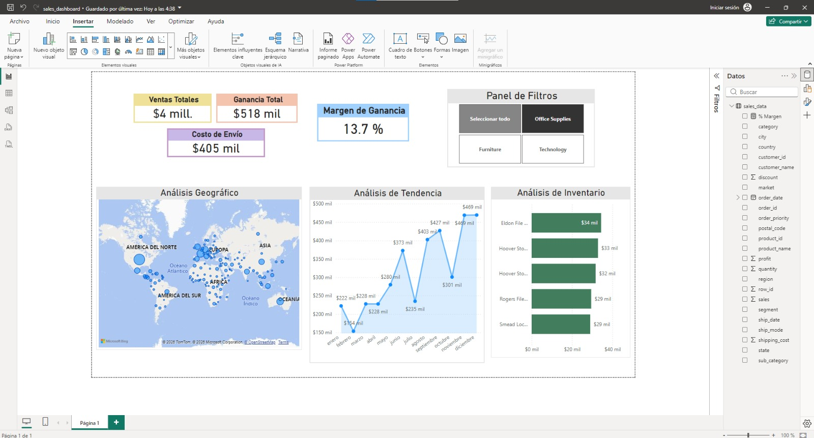
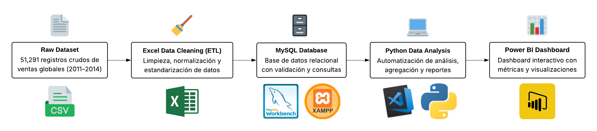
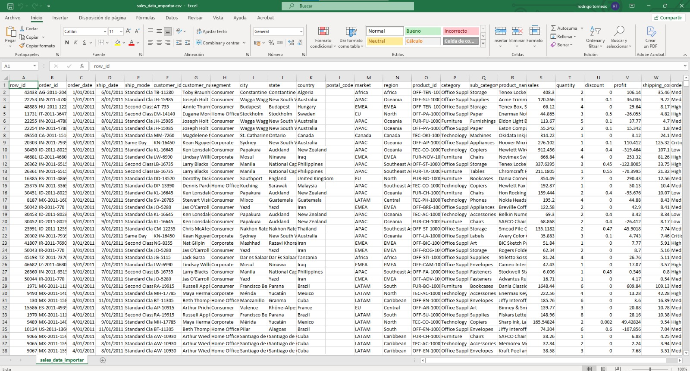
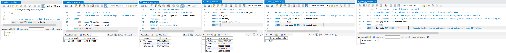
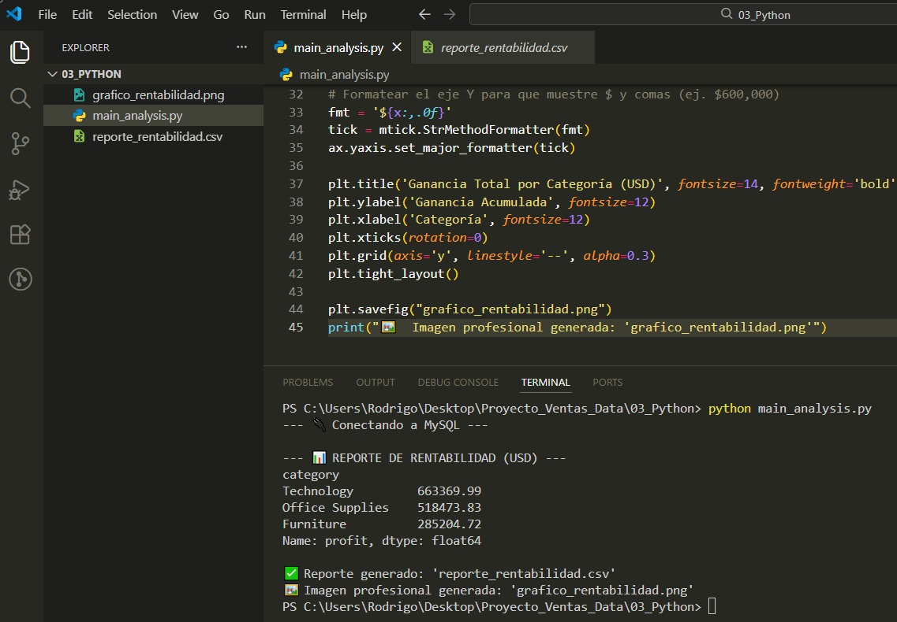

# 📊 Global Superstore — End-to-End Data Analytics Project

Proyecto **end-to-end de análisis de datos** donde se construye un **pipeline completo desde datos crudos hasta un dashboard interactivo de inteligencia de negocios**.

El proyecto demuestra habilidades prácticas en:

* Data Cleaning
* ETL
* SQL Data Modeling
* Python Data Analysis
* Business Intelligence

---

# 📊 Dashboard Preview



---

# 🚀 Project Overview

Este proyecto transforma un **dataset de ventas globales** en **insights accionables para negocio** mediante un pipeline de análisis moderno.

## 🔄 Flujo del proyecto

```
Raw Dataset
    ↓
Excel Data Cleaning (ETL)
    ↓
MySQL Database
    ↓
Python Data Analysis
    ↓
Power BI Dashboard
```



## 📊 Dataset analizado

* **51,291 registros**
* **24 columnas**
* **Periodo:** 2011 – 2014
* **Ventas totales:** $12.6M
* **Ganancia total:** $1.46M

---

# 🛠 Tech Stack

| Tool | Purpose |
|-----|------|
| Excel | Data cleaning |
| MySQL | Database & data validation |
| Python | Analysis automation |
| Pandas | Data manipulation |
| SQLAlchemy | Database connection |
| Matplotlib | Data visualization |
| Power BI | Business dashboard |

---

# 📥 Data Source

**Dataset:** Global Superstore

**Descargar:** https://www.kaggle.com/datasets/apoorvaappz/global-super-store-dataset?resource=download

### Características

* Ventas internacionales
* Clientes, productos, envíos y geografía
* Información financiera detallada

Archivo utilizado:

```
Global Superstore2.csv
```

Se eligió el **CSV sin limpiar** para simular un **escenario real de data wrangling**.

---

# 🧹 Data Cleaning (Excel)

Se realizó un proceso completo de **ETL inicial**.

## Transformaciones principales

* Normalización de columnas
* Conversión correcta de separadores numéricos
* Estandarización de fechas
* Refactorización de encabezados para SQL

### Ejemplo de refactorización

```
Order Date      → order_date
Customer Name   → customer_name
```



### Resultado

* **51,291 filas procesadas**
* **Dataset listo para carga en SQL**

---

# 🗄 Database Design (MySQL)

Se creó una base de datos optimizada para análisis.

### Schema

**Database:** `sales_project`  
**Tabla principal:** `sales_data`  

### Decisiones técnicas

* Primary Key: `row_id`
* Alta precisión financiera: `DECIMAL(19,6)`  
  Esto evita errores de redondeo en agregaciones grandes.

---

# 🔍 Data Validation (SQL)

Se ejecutaron consultas para validar la integridad del dataset.

| Métrica | Valor |
|---------|-------|
| Ventas Totales | $12,640,574 |
| Ganancia Total | $1,467,048 |

**Insights iniciales:**

* Technology es la categoría líder
* United States lidera en ventas



---

# 🐍 Data Analysis (Python)

Python se utilizó para **automatizar el análisis de datos**.

**Script principal:** `main_analysis.py`  

**Librerías utilizadas:**

```python
import pandas as pd
import sqlalchemy
import pymysql
import matplotlib.pyplot as plt
```

## 🔧 Data Wrangling

* Normalización automática de fechas:  
  `pd.to_datetime(dayfirst=True)`  
* Agrupación por categoría:  
  `df.groupby("category")["profit"].sum()`



---

# 📈 Automated Outputs

El script genera automáticamente:

1️⃣ **Reporte ejecutivo**  
`reporte_rentabilidad.csv` → Resumen de ganancias por categoría

2️⃣ **Visualización automática**  
`grafico_rentabilidad.png` → Gráfico de barras profesional listo para reportes

---

# 📊 Business Intelligence (Power BI)

Se construyó un **dashboard interactivo** conectado a MySQL mediante ODBC.

**Descargar ODBC:** https://dev.mysql.com/downloads/connector/odbc/

### Visualizaciones principales

* 🌍 **Sales by Country** → Mapa de calor para identificar mercados clave  
* 📈 **Sales Trend** → Análisis temporal para detectar estacionalidad  
* 🏆 **Top 5 Products** → Productos con mayor generación de ingresos

### 🎛 Interactive Filters

* Segmentación por categoría:  
  * Technology  
  * Furniture  
  * Office Supplies  
  Esto permite analizar todo el dashboard dinámicamente.

### 🧠 Advanced Metric (DAX)

**Profit Margin %**:

```DAX
Profit Margin % = DIVIDE(SUM(profit), SUM(sales), 0)
```

**Insights clave:**

* Margen global ≈ 11.6%  
* Furniture presenta menor eficiencia (~6.9%)

---

# 📂 Project Structure

```
Proyecto_Ventas_Data/
│
├── 01_Dataset/
│   ├── Global_Superstore_Limpio.xlsx
│   └── sales_data_importar.csv
│
├── 02_SQL/
│   ├── database_schema.sql
│   └── validation_queries.sql
│
├── 03_Python/
│   ├── grafico_rentabilidad.png
│   ├── main_analysis.py
│   └── reporte_rentabilidad.csv
│
├── 04_PowerBI/
│   └── sales_dashboard.pbix
│
└── images/
    ├── dashboard_preview.jpeg
    ├── project_pipeline.png
    ├── data_cleaning.jpeg
    ├── sql_analysis.png
    └── python_analysis.jpeg
```

---

# 📊 Key Insights

* Technology lidera las ventas globales  
* Estados Unidos es el mercado más fuerte  
* Existe estacionalidad clara en diciembre  
* Algunas categorías con alto volumen tienen márgenes bajos

---

# 🎯 Skills Demonstrated

* Data Cleaning  
* ETL Pipelines  
* SQL Data Modeling  
* Python Data Analysis  
* Data Visualization  
* Business Intelligence

---

# 📌 Future Improvements

* Automatizar pipeline con Airflow  
* Crear Data Warehouse  
* Dashboard web con Streamlit  
* Integrar Machine Learning forecasting
